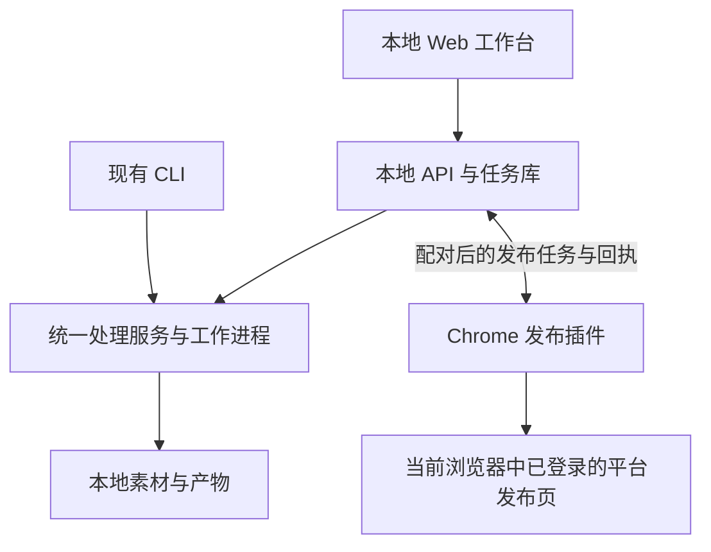

# 镜流工坊：本地工作台与发布插件开发建议

日期：2026-10-06

状态：基于当前代码的开发评估，尚未开始实现。首版按 macOS 本机、单用户、先接入抖音视频发布设计；公网多人服务不在本轮范围。

## 1. 推荐结论

继续在当前仓库开发，增加两个可以独立构建的前端子项目：本地 Web 工作台、Chrome 发布扩展。现有 Python 代码作为处理引擎，增加本地 API 和统一任务服务。

“独立插件”指独立运行、构建和安装，不要求另建 Git 仓库。仓库可以统一管理，运行进程和依赖仍然分开。

| 方式 | 优点 | 代价与适用情况 |
| --- | --- | --- |
| 同一仓库、模块分离（推荐） | 现有处理能力、产物格式、任务协议可以一起演进；生产到发布衔接直接 | 需要明确 Python、Web、扩展之间的接口，分别管理依赖和构建 |
| 发布平台另建仓库 | 产品和发版独立，适合独立团队或面向外部用户单独运营 | 当前会增加接口同步、素材交接、版本兼容和重复任务管理工作 |
| 将全部功能直接加入现有 CLI 或扩展页面 | 最初包装少量按钮比较快 | 长任务、浏览器自动化和页面展示容易相互依赖，不适合作为后续架构 |

后续如果发布插件成为独立产品，可以在协议稳定后拆仓。代码放在哪个仓库本身不决定平台风控；发布账号、授权范围和执行策略需要单独控制。

## 2. 当前代码核验

本次是静态代码与结构检查，没有重新执行视频处理或实际发布任务。

| 当前能力 | 证据 | 接入判断 |
| --- | --- | --- |
| CLI、下载、批处理 | `main.py`、`src/cli.py`、`src/core/video_downloader.py`、`src/utils/batch_processor.py` | 可以复用，需将参数和任务状态从 CLI 中解耦 |
| 清洗、切镜、音频提取、转录 | `src/core/video_analyzer.py` 及对应处理模块 | 可接入任务表单和结果页；清洗能力限于当前实现范围 |
| AI 语义分镜 | `src/core/semantic_scene_grouper.py` | 可复用；保留环境变量读取凭据和基础分析结果复用规则 |
| 历史结果与结构化素材 | `report.json`、`transcript_detailed.json`、`src/models/artifacts.py` | 可制作历史列表、视频预览、镜头和字幕展示 |
| 镜头池混剪与剪映草稿 | `src/composition/`、`src/exporters/` | 可制作配置页面、时间线摘要和草稿导出入口 |
| 随机模板混剪 MP4 | `src/utils/random_template_composer.py:render_template` | 当前工作区已有实现，输出 MP4 和选片 JSON；仍需接入统一任务服务 |
| 混剪 MP4 与剪映草稿组合输出 | `create_jianying_montage.py:create_outputs` | 当前工作区已有实现；还依赖外部 `jianying-editor` 环境，需要独立能力检查 |
| Web 页面 | `src/web/README.md` | 目前只有规划，没有实际 Web 服务和前端 |
| 平台发布 | `src/utils/platform_adapter.py` | 这是未实现的视频规格适配接口，不是账号发布适配器 |
| 压缩、OCR 等扩展功能 | 多个 `src/core/` 文件中的 `NotImplementedError` | 不作为首版可用功能；通用字幕模块的占位状态也不能与已有剪映字幕能力混淆 |

当前 `main.py` 已返回 CLI 退出码，`run.sh` 已使用项目绝对路径定位解释器；无需沿用旧记忆中对这两点的缺陷判断。

## 3. 建议目录与技术选型

以下是拟议结构，不要求第一步搬动现有文件。

```text
qing_xu_auto_2chuang/
├── main.py / run.sh             现有 CLI 入口
├── src/
│   ├── core/                   现有视频处理
│   ├── composition/            现有混剪
│   ├── exporters/              现有剪映导出
│   ├── models/                 现有产物模型
│   ├── services/               新增：任务、素材、处理流程服务
│   └── web/                    新增：FastAPI HTTP 接口
├── apps/
│   ├── workbench/              新增：React + TypeScript + Vite
│   └── publisher-extension/    新增：React + TypeScript + WXT / MV3
├── packages/contracts/         新增：前端和扩展共用的版本化协议
├── data/                       新增：本机 SQLite 与索引，不提交 Git
├── output/                     继续保留现有输出
└── tests/                      Python 测试；JS 项目各自管理测试
```

- Python API：FastAPI；Pydantic 定义请求和结果协议。
- 任务与素材索引：SQLite。大视频继续存文件，不存数据库。
- 进度展示：服务端事件流 SSE；开始、取消等操作使用 HTTP 请求。
- 长任务：独立受管工作进程，首版默认串行运行重型视频任务。
- Web 和扩展的构建、运行依赖分开；插件安装包不携带 Python、Whisper 或 FFmpeg。
- Python API 的 OpenAPI/JSON Schema 生成 TypeScript 类型；浏览器消息协议带版本号，避免多处手工维护不一致的数据结构。
- 不修改用户全局 shell 配置。Python 使用项目虚拟环境，前端使用项目依赖。

## 4. 运行关系



工作台负责生产管理：素材、处理任务、混剪、成片、发布任务和历史记录。插件负责在浏览器里识别账号、上传、填表、按授权提交并回报结果。平台登录状态保留在浏览器，不复制到 Python 服务。

普通 Web 页面不能直接跨站操纵抖音的发布界面，因此加工作台前端后，发布插件仍有独立职责。

初期使用受保护的本地 HTTP 连接即可，不必马上引入 Native Messaging、Electron 或公网服务。服务绑定 `127.0.0.1`，限定工作台来源和配对扩展，校验连接凭据；不能认为“运行在本机”就可以允许任意网页调用。浏览器对本地网络访问的权限提示与兼容性在原型阶段验证。

文件通过注册后的素材 ID 获取，只允许访问用户明确导入的文件或授权素材目录。预览接口支持 Range 请求；插件取文件须经过授权与大小检查，不提供任意本地路径读取接口。

## 5. 前端页面建议

| 页面 | 首版范围 | 与现有能力的关系 |
| --- | --- | --- |
| 素材与历史结果 | 浏览已配置目录、导入文件、展示视频信息；读取已有结果 | 复用 `output/` 和报告，后台建立轻量索引 |
| 新建处理任务 | 本地视频或链接输入；清洗、原始切镜、音频转录、语义分镜参数 | 对接现有处理能力和校验规则 |
| 任务中心 | 排队、当前阶段、日志、成功/跳过/失败、产物入口 | 需要新建统一任务模型和事件机制 |
| 分析详情 | 原片/处理后视频、原始镜头、语义分组、转录文本与时间戳 | 以现有 JSON 产物为主，不因打开页面重新跑分析 |
| 混剪与剪映导出 | 镜头池、头部模式、随机种子、模板选片预览、输出类型 | 分别接入已有混剪路径；先做表单与时间线摘要 |
| 成片与发布 | 选择可发布 MP4、配置文案封面、发送到插件、查看回执 | 新增统一成片登记和发布任务协议 |
| 设置 | 素材目录、草稿目录、模型选择、依赖状态、插件连接 | 敏感凭据不回传浏览器，不存前端持久化存储 |

首版不开发浏览器内完整剪辑时间线。当前剪映草稿流程继续交给剪映精修；将“草稿”“处理后素材”“预览 MP4”“确认可发布成片”标记为不同产物类型。

`create_jianying_montage.py` 先渲染预览 MP4，再向剪映草稿添加标题与关键帧，不能假设该预览文件与剪映最终导出画面完全一致。进入发布队列前，应选择并确认实际要发布的文件。

## 6. 接前端前需要补的服务能力

### 6.1 任务与参数解耦

`BatchProcessor.process_video` 接收命令行参数对象，返回布尔值；进度主要通过 `print` 输出。新增明确的处理请求和结果模型，让 CLI 与 API 调用同一业务流程，不分别复制一套逻辑。

结果至少包括任务 ID、任务类型、成功/失败/跳过原因、输出目录和产物列表。保留既有目标文件存在时跳过分解等行为；“跳过”不能被 UI 误标为刚完成了整套分析。

### 6.2 长任务和事件

FFmpeg、切镜和 Whisper 不在 HTTP 请求线程内直接执行，也不依赖内存中的临时后台任务保存状态。工作进程领取任务，持久化阶段事件，页面刷新不取消任务。

首版进度以真实阶段、已处理数量和日志为主。有可用底层进度时才展示百分比；没有时展示进行中，不生成虚假进度。

重启后将无法确认的运行中任务标为中断或待核查，不承诺所有算法都可任意断点续跑。取消任务需处理其 FFmpeg 等子进程，并隔离不完整输出。初期串行、任务独立工作目录与资源锁共同防止文件和草稿索引写入冲突。

### 6.3 消除后台交互等待

`resolve_draft_root` 在目录检测失败时会调用终端 `input()`。Web 路径必须提前提供并校验草稿目录，缺失时返回可处理的配置错误，不能让后台任务等终端输入。

涉及外部剪映封装的脚本，在提交前检查依赖、草稿目录和素材。环境缺失时只禁用对应能力，不影响切镜、转录和历史浏览。

### 6.4 统一素材、成片与发布记录

建立素材、处理任务、产物、发布任务和执行事件的关联。SQLite 管索引与状态，现有 JSON 文件继续作为历史产物保存。

已有 CLI 结果通过导入索引进入工作台；后续通过统一服务启动的 CLI 任务也写入同一任务库。API 和 CLI 共用参数校验、跳过规则和输出类型定义。

历史浏览不要在每次请求中调用会触发媒体探测或音频分析的完整产物加载流程，优先读取缓存元数据。

## 7. 插件接入边界

发布任务绑定目标平台、预期账号、成片 ID、文案/封面版本和发布模式。插件实际识别到的账号必须匹配，提交前再次检查。

模式分开：

- 本地检查：只校验素材和参数，不向平台上传。
- 预填预览：会上传到平台并填表，但停在最终发布前。
- 直接发布：用户明确授权本批任务后，检查通过再提交。

插件负责领取任务、上传素材、页面适配和回执。服务保存统一记录；插件离线显示“等待插件”，不能算作已发布。执行租约失联、提交超时或结果不明时先核查，不自动转交另一执行器重复提交。

Chrome MV3 后台可能休眠，普通扩展消息也不能被当成无限制的视频传输通道。原型阶段验证真实文件大小、分片传输与内存占用、目标网页接收、关闭页面后的恢复行为，不依赖跨站 Blob URL 必然可读。

账号 Cookie 保留在浏览器；验证码、登录失效、限频、页面改版或账号不匹配时暂停。电脑草稿与手机草稿互通不作为功能前提。平台风控仍以平台规则及真实反馈为准。

## 8. 推荐开发顺序与验收

### 阶段一：现有结果可视化

- 建立本地 API、素材索引和工作台。
- 展示历史结果、视频、镜头、转录和已有成片。
- 验收：不重新处理历史视频，已有文件可预览，缺失或损坏结果可识别。

### 阶段二：从页面启动处理

- 抽取统一请求、结果、任务事件和工作进程。
- 接入新建任务、队列、日志、配置校验和取消处理。
- 验收：CLI 与 UI 相同参数得到相同业务结果；页面刷新任务继续；错误和跳过状态准确。

### 阶段三：混剪与成片管理

- 接入镜头池混剪、随机模板选片与剪映导出。
- 选片方案先生成并固定，执行时使用同一方案，不因再次随机导致预览和输出不同。
- 验收：明确区分草稿、预览与成片；成片文件可独立打开；缺失外部剪映依赖时给出准确状态。

### 阶段四：抖音发布闭环

- 开发独立插件，先验证文件传输与预填，再接明确授权的直接发布。
- 接入本地配对、目标账号核验和工作台回执。
- 验收：错账号停止、验证码暂停、重复任务拦截、提交结果未知不重发；真实发布另用明确授权内容验证。

### 阶段五：新增平台与独立分发

- 稳定抖音适配后增加下一平台，复用统一任务模型。
- 插件保留手动选取本地素材的入口，使其可在没有 Python 处理服务时独立使用。
- 如需公网多人产品，再单独设计用户权限、租户隔离、云素材和远程执行设备；不直接开放当前本地服务。

## 9. 本轮范围

本次交付为项目组织和开发顺序建议，没有创建前端脚手架、修改处理逻辑、移动已有文件或进行实际发布。现有工作区中的未提交混剪改动保持原状。
